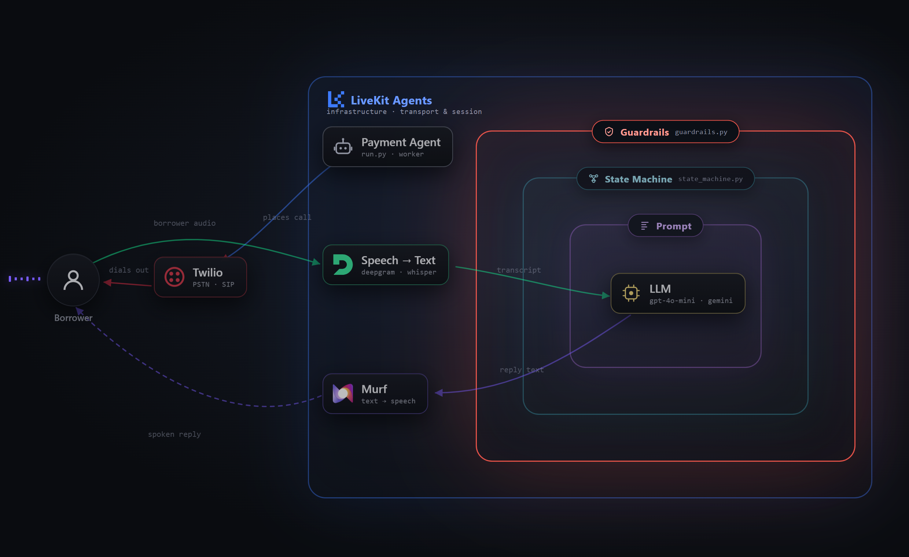
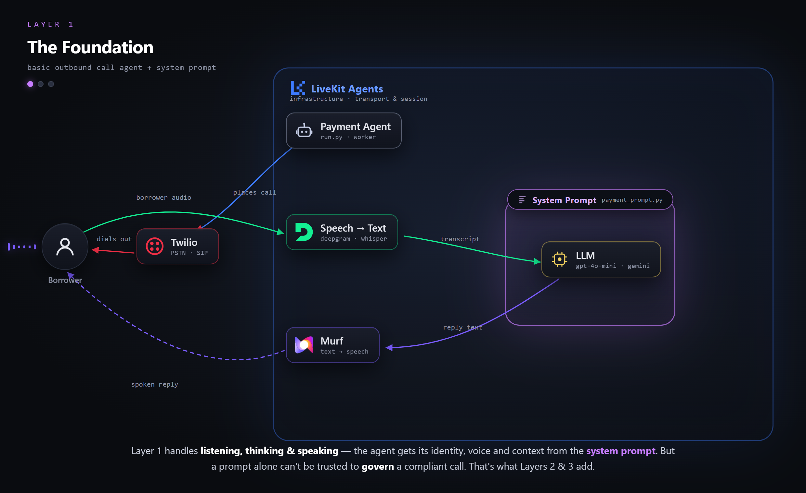
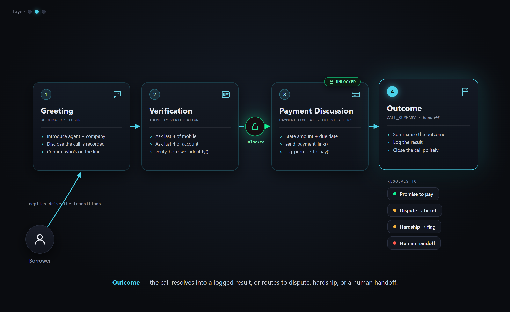
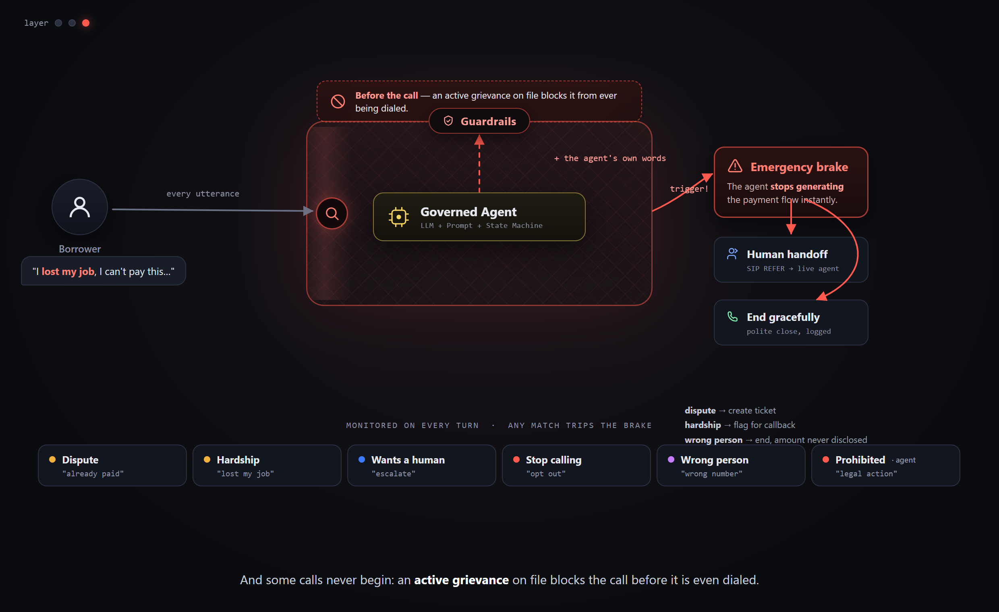

# Payment Reminder Agent

An outbound AI voice agent that calls borrowers, verifies their identity, presents payment context, and handles disputes, hardship, and human handoff — all within a strict compliance guardrail layer.

[](https://python.org)
[](https://docs.livekit.io/agents)

[](https://murf.ai/api)
[](https://twilio.com)



---

## What it does

- **Dials outbound** via Twilio PSTN → LiveKit SIP outbound trunk, speaks with Murf Falcon TTS
- **Verifies borrower identity** using the last four digits of both their registered mobile number and their account number before disclosing any account details
- **Presents payment context** — amount due, due date, and a payment link sent to their registered number
- **Records a promise to pay** with a commitment date when the borrower agrees
- **Stops the payment flow immediately** if the borrower disputes, reports hardship, asks to stop being called, or requests a human
- **Blocks the call entirely** when the account has an active grievance ticket
- **Logs structured outcome and transcript files** (`logs/`) after every call
- **Sends post-call WhatsApp confirmations** via Twilio when configured
- **Transfers to a human agent** via SIP REFER when escalation is needed

---

## Architecture

The agent is built in three layers, each adding a stronger compliance guarantee on top of the one below it.

### Layer 1 — The Foundation

A basic outbound call agent driven by a system prompt. Twilio dials the borrower over PSTN/SIP, LiveKit Agents runs the session, and audio streams through Deepgram/Whisper (STT) → the LLM (`gpt-4o-mini` or Gemini) → Murf Falcon (TTS). A prompt alone can listen, think, and speak — but it can't be trusted to *govern* a compliant call. That's what Layers 2 and 3 add.



### Layer 2 — The Enforcer

A state machine ([`state_machine.py`](state_machine.py)) drives the call through a fixed sequence — greeting → identity verification → payment discussion → outcome. Account details stay **locked** until the borrower verifies the last four digits of their registered mobile and account number. The call always resolves to a logged outcome: promise to pay, dispute, hardship, or human handoff.



### Layer 3 — The Safety Net

Guardrails ([`guardrails.py`](guardrails.py)) monitor every utterance. A dispute, hardship, opt-out, wrong-person, or a request for a human trips the emergency brake — the agent stops the payment flow instantly and routes to the right resolution. And some calls never begin: an account with an active grievance on file is blocked before it is ever dialed.



---

## Project structure

```
payment-reminder/
├── agent.py              # LiveKit agent worker (entrypoint, session, greeting)
├── run.py                # Main CLI — single call or CSV campaign
├── config.py             # Environment variable loading and validation
├── mock_data.py          # Per-call config (scenario_config.json + dispatch metadata)
├── guardrails.py         # Pre-call checks and utterance-level compliance rules
├── state_machine.py      # Call state transitions and allowed actions per state
├── outcome_log.py        # Structured outcome JSON written after each call
├── scenario_config.json  # Default borrower/company details for single-call mode
├── reminders.csv         # Example campaign CSV
├── dispatch-rule.json    # LiveKit dispatch rule reference (paste into Cloud console)
├── prompts/
│   └── payment_prompt.py # System prompt builder (per state)
├── tools/
│   ├── payment_tools.py  # Agent tools: verify identity, send link, log PTP, etc.
│   ├── handoff.py        # SIP transfer to human agent
│   ├── transcript.py     # Transcript collection (saved to logs/)
│   └── whatsapp.py       # Post-call WhatsApp confirmations
├── scripts/
│   ├── setup_outbound_trunk.py  # One-time Twilio → LiveKit SIP trunk setup
│   ├── run_scenario.py          # Dry-run scenario preview (no phone/API)
│   ├── list_voices.py           # List Murf voice ids for a locale
│   └── test_whatsapp.py         # Test WhatsApp message templates
├── diagrams/             # Architecture diagrams (interactive HTML + PNG exports)
└── logs/                 # Runtime output (outcome JSON + transcripts)
```

---

## Call flow

```
run.py
  → LiveKit: create room + create dispatch (phone + borrower metadata)
    → agent worker: prewarm (VAD + Murf TTS)
      → entrypoint: session.start()
        → create_sip_participant (outbound trunk → Twilio → PSTN)
          → borrower's phone rings → borrower answers
            → agent greets and begins conversation
```

### State machine

```
PRE_CALL_CHECK
  → OPENING_DISCLOSURE       (agent introduces itself, asks "Am I speaking with <name>?")
    → IDENTITY_VERIFICATION  (last four digits of registered mobile + account number)
      → PAYMENT_CONTEXT      (amount, due date, offer payment link)
        → INTENT_CLASSIFICATION
          → SEND_PAYMENT_LINK  → PROMISE_TO_PAY  → CALL_SUMMARY
          → DISPUTE_INTAKE     → HUMAN_HANDOFF
          → HARDSHIP_ESCALATION → HUMAN_HANDOFF
  → WRONG_PERSON_END         (any state — triggered by guardrail)
  → HUMAN_HANDOFF            (any state — triggered by guardrail)
```

---

## Quick start

### 1. Install

```bash
python -m venv venv
venv\Scripts\Activate.ps1        # Windows
# source venv/bin/activate       # macOS / Linux
pip install -r requirements.txt
```

### 2. Configure

```powershell
Copy-Item .env.example .env      # Windows
# cp .env.example .env           # macOS / Linux
```

Fill in `.env`. See [Environment variables](#environment-variables) below.

### 3. Download VAD model

```bash
python agent.py download-files
```

### 4. Set up telephony (one time)

See [Telephony setup](#telephony-setup).

### 5. Run

```bash
# Single outbound call (uses scenario_config.json for borrower details)
python run.py --to +919876543210

# Campaign from CSV (sequential — one call at a time)
python run.py --csv reminders.csv

# Campaign from CSV (parallel — all calls at once)
python run.py --csv reminders.csv --mode parallel
```

`run.py` starts the agent worker automatically and dispatches the call.

---

## Environment variables

**Required**

| Variable | Where to get it |
|---|---|
| `LIVEKIT_URL` | [LiveKit Cloud](https://cloud.livekit.io) dashboard |
| `LIVEKIT_API_KEY` | LiveKit Cloud → Settings → API Keys |
| `LIVEKIT_API_SECRET` | Same page as API key |
| `MURF_API_KEY` | [murf.ai/api/dashboard](https://murf.ai/api/dashboard) |
| `STT_PROVIDER` | `deepgram` (default) or `openai` |
| `DEEPGRAM_API_KEY` | [console.deepgram.com](https://console.deepgram.com) — if `STT_PROVIDER=deepgram` |
| `OPENAI_API_KEY` | [platform.openai.com](https://platform.openai.com) — if `STT_PROVIDER=openai` or `LLM_PROVIDER=openai` |
| `LLM_PROVIDER` | `gemini` (default), or `openai` |
| `GOOGLE_API_KEY` | [aistudio.google.com](https://aistudio.google.com) — if `LLM_PROVIDER=gemini` |
| `LIVEKIT_SIP_OUTBOUND_TRUNK_ID` | Run `python scripts/setup_outbound_trunk.py` once |

**Optional**

| Variable | What it enables |
|---|---|
| `MURF_VOICE_ID` | Voice id override for the `agentVoice` in `scenario_config.json` — list options with `python scripts/list_voices.py <locale>` |
| `LIVEKIT_SIP_URI` | SIP REFER transfers to a human agent |
| `HUMAN_TRANSFER_NUMBER` | Phone number to transfer to when the agent escalates |
| `TWILIO_ACCOUNT_SID` / `TWILIO_AUTH_TOKEN` | WhatsApp confirmations and trunk setup |
| `TWILIO_PHONE_NUMBER` | Caller ID on outbound calls |
| `TWILIO_WHATSAPP_FROM` | Post-call WhatsApp sender (e.g. `whatsapp:+14155238886`) |

---

## LLM and STT providers

Set in `.env` — no code changes needed.

| `LLM_PROVIDER` | Model | API key |
|---|---|---|
| `gemini` | `gemini-2.5-flash` | `GOOGLE_API_KEY` |
| `openai` | `gpt-4o-mini` | `OPENAI_API_KEY` |

| `STT_PROVIDER` | Model | API key |
|---|---|---|
| `deepgram` | `nova-3` | `DEEPGRAM_API_KEY` |
| `openai` | `gpt-realtime-whisper` | `OPENAI_API_KEY` |

---

## Telephony setup

### Step 1 — Twilio Elastic SIP trunk

1. [console.twilio.com](https://console.twilio.com) → Elastic SIP Trunking → Create trunk
2. Termination tab → note the SIP URI (e.g. `mytrunk.pstn.twilio.com`)
3. Create a credential list (username + password) and attach it to the trunk

Add to `.env`:

```env
TWILIO_SIP_TERM_URI=mytrunk.pstn.twilio.com
TWILIO_SIP_USERNAME=your-username
TWILIO_SIP_PASSWORD=your-password
TWILIO_PHONE_NUMBER=+12015551234
```

### Step 2 — LiveKit outbound SIP trunk

```bash
python scripts/setup_outbound_trunk.py
```

Copy the printed `LIVEKIT_SIP_OUTBOUND_TRUNK_ID` into `.env`.

### Step 3 — LiveKit dispatch rule

In [LiveKit Cloud](https://cloud.livekit.io) → Telephony → Dispatch Rules, paste the contents of `dispatch-rule.json`:

```json
{
  "name": "payment-agent",
  "rule": {
    "dispatchRuleIndividual": {
      "roomPrefix": "payment-"
    }
  },
  "roomConfig": {
    "agents": [{ "agentName": "payment-agent" }]
  }
}
```

The `agentName` must match exactly.

### Step 4 — Human handoff (optional)

```env
LIVEKIT_SIP_URI=abc123.sip.livekit.cloud
HUMAN_TRANSFER_NUMBER=+918041234567
```

Enable **SIP REFER** in Twilio: Elastic SIP Trunking → your trunk → Call Transfer (SIP REFER).

---

## Scenarios

For single-call mode (`--to`), borrower details come from `scenario_config.json`.
For campaigns (`--csv`), each row supplies its own details; `scenario` is always `normal_reminder`.

| Scenario | What happens |
|---|---|
| `normal_reminder` | Identity verified → amount disclosed → payment link → promise to pay |
| `already_paid` | Borrower disputes → dispute ticket → human handoff |
| `hardship` | Borrower reports hardship → account flagged → human callback |
| `wrong_person` | Wrong person answers → call ends, amount never disclosed |
| `grievance_pending` | Active grievance → call blocked before it starts |

Preview a scenario without placing a call:

```bash
python scripts/run_scenario.py --scenario normal_reminder
python scripts/run_scenario.py --scenario grievance_pending
```

---

## CSV campaign format

`reminders.csv` columns:

| Column | Required | Notes |
|---|---|---|
| `name` | yes | Borrower name |
| `phone` | yes | E.164 format: `+919876543210` |
| `amount_due` | yes | Plain integer |
| `due_date` | yes | e.g. `June 21, 2026` |
| `account_ending` | yes | Last four digits of account |
| `registered_mobile_last_four` | yes | For identity verification |

---

## Logs

After each call, two files are written to `logs/`:

- **Outcome log** — `logs/<scenario>_<timestamp>.json` (identity verified, dispute detected, outcome label, etc.)
- **Transcript** — `logs/<name>_<last4>.json` (full conversation turns)

Possible `outcome` values: `promise_to_pay`, `payment_dispute`, `hardship_detected`, `identity_mismatch`, `call_blocked`, `transferred_to_human`, `unknown`.

---

## Testing utilities

```bash
# Preview scenario flow and prompts (no API calls)
python scripts/run_scenario.py --scenario hardship

# Test WhatsApp message templates
python scripts/test_whatsapp.py --outcome promise_to_pay --dry-run
python scripts/test_whatsapp.py --list-outcomes

# List available Murf voices for a locale (to pick a voice id)
python scripts/list_voices.py en-IN

# Browser-based voice testing (no phone)
python agent.py dev
```

Open the [LiveKit Agents Playground](https://agents-playground.livekit.io/) and connect with your LiveKit credentials.

---

## Adapting for your use case

| What to change | File |
|---|---|
| Company name, agent name, voice | `scenario_config.json` (`agentVoice`) — or set `MURF_VOICE_ID` in `.env` to override it |
| System prompt and call script | `prompts/payment_prompt.py` |
| Guardrail phrases | `guardrails.py` |
| Call states and transitions | `state_machine.py` |
| Payment tools (replace mocks with real APIs) | `tools/payment_tools.py` |

---

## Common errors

| Error | Fix |
|---|---|
| `Required environment variable 'X' is not set` | Copy `.env.example` to `.env` and fill in the variable |
| `LIVEKIT_SIP_OUTBOUND_TRUNK_ID not set` | Run `python scripts/setup_outbound_trunk.py` |
| Phone rings but agent stays silent | Dispatch rule missing `agentName: payment-agent` in `roomConfig.agents` |
| `DuplexClosed` mid-greeting | Use `python agent.py start` for phone testing, not `dev` |
| Call blocked immediately | `scenario` is `grievance_pending` in `scenario_config.json` |
| Invalid phone in CSV | Use E.164 format with leading `+`; avoid Excel scientific notation |
